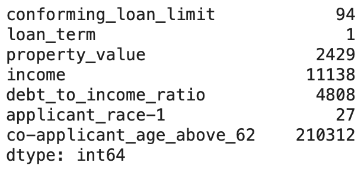
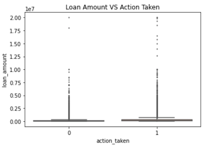
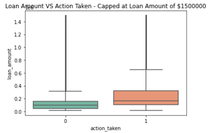
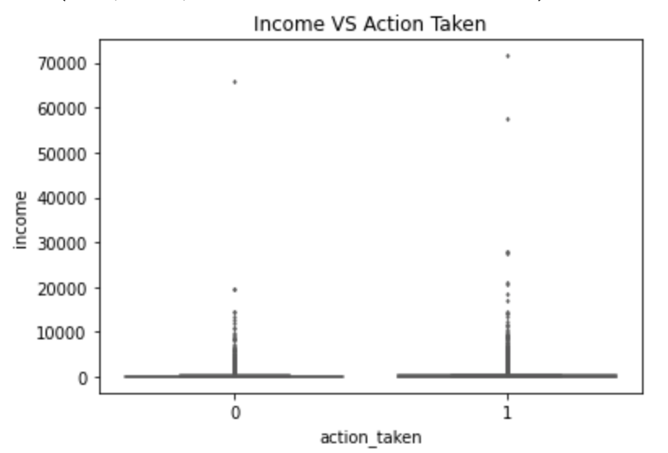
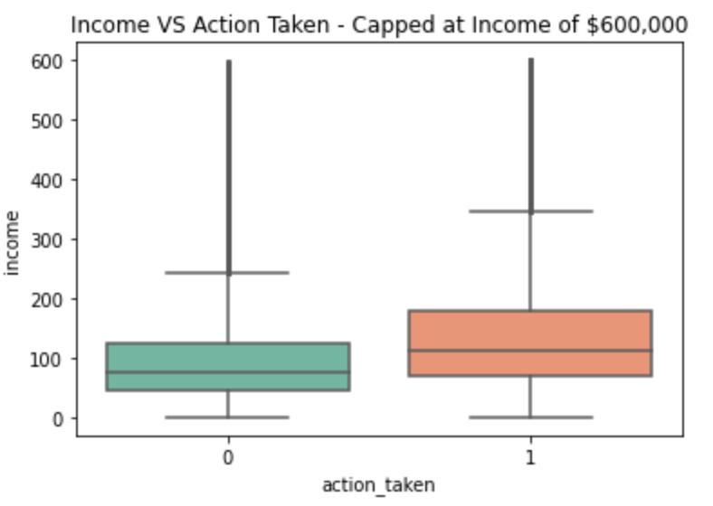
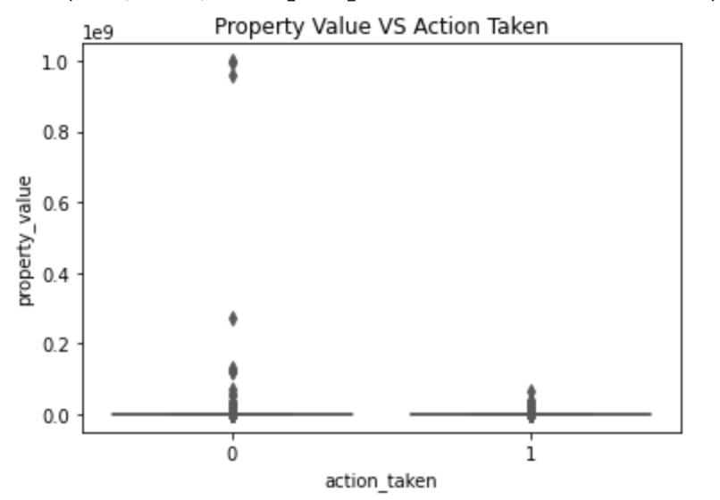
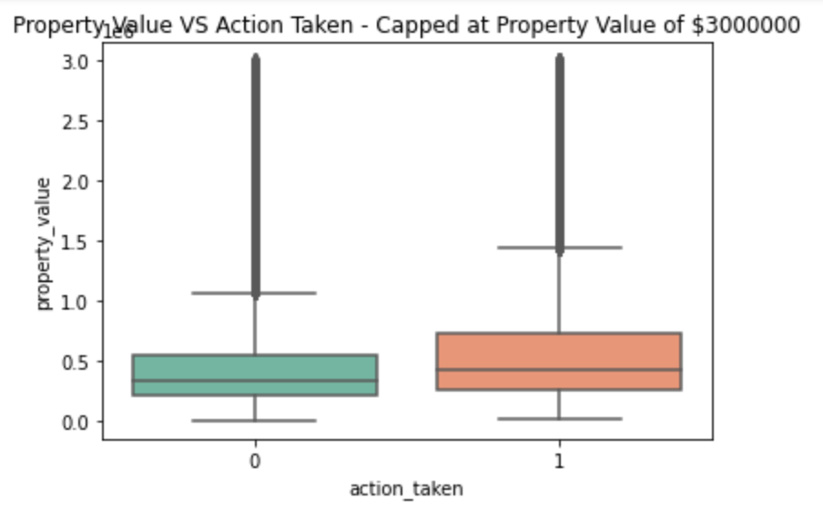
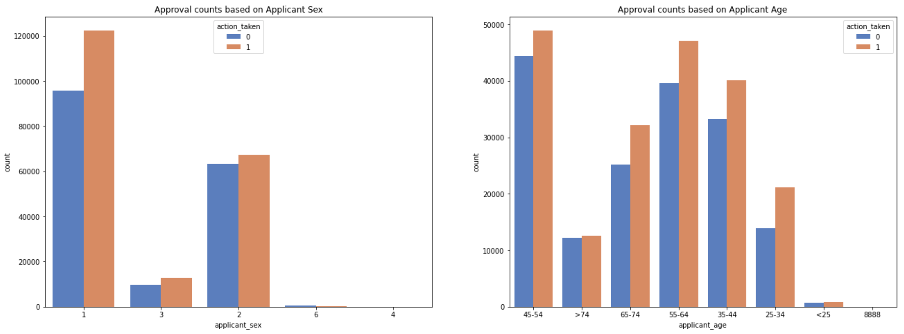
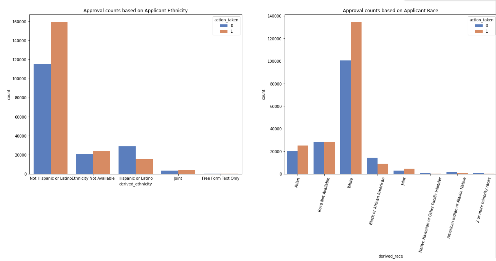
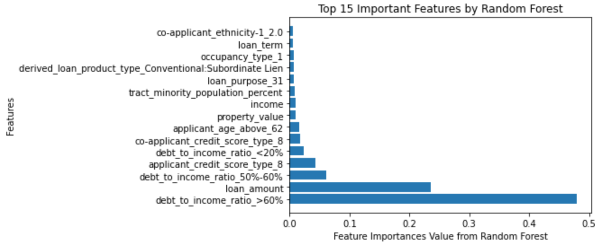

## Project Midterm Report
--- 
From: Jing Zhang (wz223), Qiwen Li (ql257), Yuqing Xu (yx486)

### Project Question and Description
Credit scores help banks, loaners, and others justify or evaluate a person’s ability to return their debt enabling them to make the right decisions in loan approval, and help disadvantaged individuals/groups to get loan approved. Loan evaluation would help in minimizing loan risk, maximizing banks’ profits, and protecting margins. The goal of our project is to evaluate the fairness of the current loan system at Bank of America across the United States in 2018 with data provided by HMDA Data Browser, 
### Avoid over (and under-) fitting
Overall, to avoid overfitting/underfitting, we have split up the dataset into the training and testing set in which we will apply validation methods such as examining MSE in training data and testing data.
Considering that we have a large amount of features, we are less concerned with underfitting. By looking at loan applications from all over the country, we are able to obtain a large sample size, and the large number of features would increase the model’s complexity, which prevents overfitting.
### Test the effectiveness of the models we develop:
We are planning to use a validation set, k-fold-validation specifically to test effectiveness. We also plan to compare MSE for different models to choose the optimal model.
### Data Cleaning and Transformation

When we first examined our dataset, among the 99 features, we decided to first manually remove 63 features that we considered as irrelevant or duplicate information based on the feature definition and possible values of each feature presented on the data field website.
Next, we convert the data type for categorical features into string type values in order to input them into different algorithms in the future. Then, we treat categorical features that contain only two possible values as boolean values corresponding to the values of 0 and 1. For categorical features with multiple values, we applied one hot encoding. Furthermore, we decided to drop some of the outliers that we have identified in our data exploratory phase and also looked through the columns with missing values.

 **Columns with Missing Values**
 

we decided to drop some of the insignificant rows that are missing in value in various columns, like conforming_loan_limit, loan_term, property_value, debt_to_income_ratio, and applicant_race-1, since there are less than 2% of our data don’t have these values. For missing values in the applicant_age_above_62 column, we considered them as “not applicable” because the other two values are 1(yes) and 2(no) so we replaced the missing ones with value 3, indicating “not applicable”. Lastly, we realized that the income column is also partially absent. So we created another feature, ‘missing_income’, that states if the value in the income column is missing which we thought would be interesting to examine later on. In order to fix the problem of missing income, we looked at correlations between other variables and income and we found out that loan amount is the highest correlated variable. With the loan amount, we applied the linear regression model to predict the missing income values based on the loan amount. 
For our target feature, “action taken”, which tells whether the loan application is approved or not, we transform the feature value to 1 if it’s approved, and 0 otherwise.

### Number of features and examples presented

Now, the dataset contains documentation of 371,930 samples of loan applications with 31 features that we determined as valuable and insightful in determining our loan approval models. Some examples of the features are derived_race, debt_to_income_ratio. 
### Histogram and boxplots for various important features about the dataset

Boxplot to see the distribution of features by loan approval status, - percentile, it helps us identify outliers which were removed in later data-cleaning process.

|

 

Histogram to see the variability of the numbers of loan applications that are approved or disapproved based on some features that we considered as bias which are age, race, sex, and ethnicicity. 
Oberservation: The number of applications approved is lower for underrepresented groups among each classification of sex, age, race, and ethnicity. Most prominently in ….

### Exploratory Data Analysis (preliminary analyses)
We are exploring the most correlated features associated with the target feature, and investigating whether those features are significant by performing regression (linear regression and logistic regression), and random forest. 
After data preprocessing, we divide the dataset into two parts, with 80% of the data as the training set and the rest 20% as the test set.  We used linear regression for features with  numerical values, and we used logistic regression on features with categorical values and boolean values. 
We performed random forest to further investigate the top 15 important features of loan approval.

 

### Plan for developing the project over the rest of the semester

We are planning to perform regularization to prevent overfitting, and decrease variance. Another reason for using regularization is that we aim to develop a new system that is fair, and it will penalize certain unfair features towards loan approval.

### Plan for developing the project over the rest of the semester
We are planning to perform regularization to prevent overfitting, and decrease variance. Another reason for using regularization is that we aim to develop a new system that is fair, and it will penalize certain unfair features towards loan approval.

